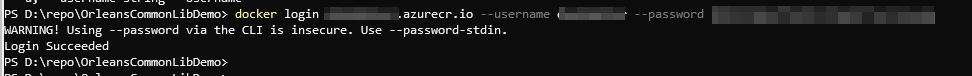
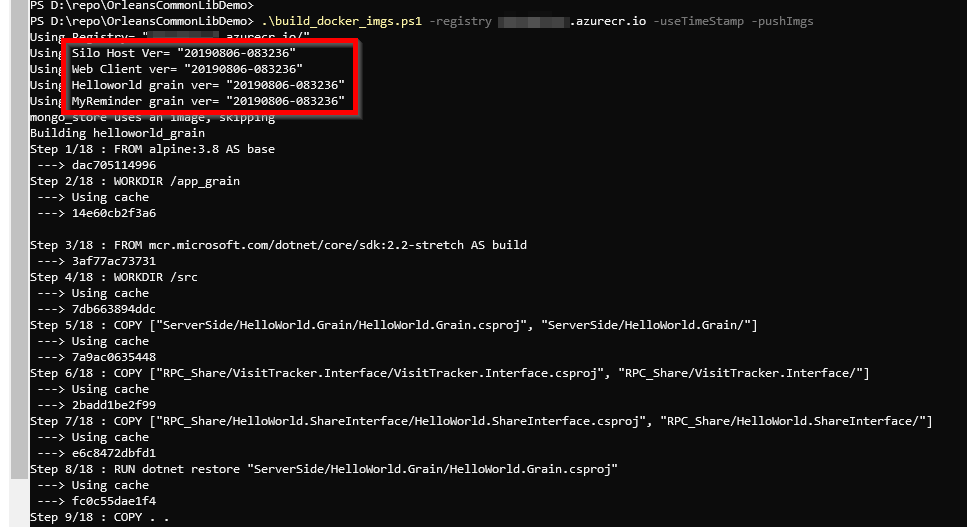

# GranDen Orleans common libarary Demo

This repository contains the example usage of Microsoft Orleans hosting library: [Orleans.NetCoreGenericHost.CommonLib](https://github.com/GranDen-Corp/Orleans.NetCoreGenericHost.CommonLib) and Client connecting library : [Orleans.Client.CommonLib](https://github.com/GranDen-Corp/Orleans.Client.CommonLib).

To build and distributable docker images:

1. Invoke docker login command to be able to access your target docker registry server:
   
2. Run the `build_docker_imgs.ps1 -registry your_registry_url -useTimeStamp` on root directory to produce versioned docker images using timestamp and imemdiately push to target docker registry:
     
   It will automatically build and push docker images to remote docker registry.
